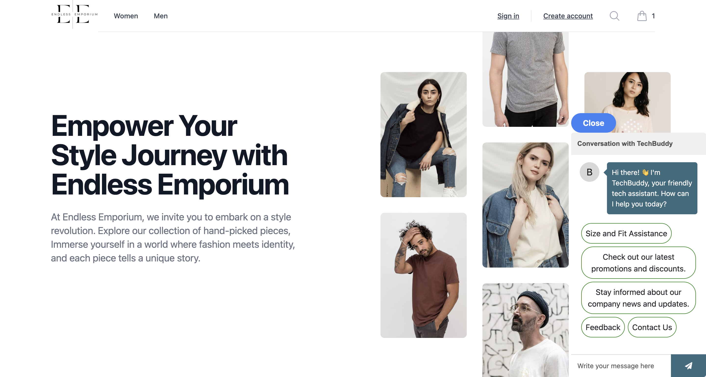

# Endless Emporium


# Description
Endless Emporium is a web application that allows users to shop and buy items and products. This application integrates fake store API and Stripe for the application.

## User Story
```
AS A customer I want to be able to shop at Endless Emporium
SO THAT I can buy products at an online store
```
## Acceptance Criteria
In this project and our group will use everything we’ve learned to create a real-world client-side single-page application that we’ll be able to showcase to potential employers. The user story and acceptance criteria will depend on the project that our group will create, but our project must fulfill the following requirements:
- Use React.
- Use Node.js.
- Have both GET and POST routes for retrieving and adding new data.
- Be deployed using Netlify.
- Use at least two libraries, packages, or technologies that we haven't discussed.
- Have a polished front end/UI.
- Meet good quality coding standards (indentation, scoping, naming).
- Have a quality README (with unique name, description, technologies used, screenshot, and link to deployed application).

## Table of Contents (Optional)
- [Installation](#installation)
- [Usage](#usage)
- [Credits](#credits)
- [License](#license)

## Installation

To install necessary dependencies, please run the following command: 

```bash
npm install 
```


[link to deployed application](https://endless-emporium.netlify.app/)

## Usage
This application allows users to buy products at an online store.

# Credits
*[W3 School](https://www.w3schools.com/js/default.asp)
*[code academy](https://www.codecademy.com/learn)
*[mozilla developer](https://developer.mozilla.org/en-US/docs/Web/) 
*[React Icons](https://react-icons.github.io/react-icons/) 
*[React Router](https://reactrouter.com/en/main) 
*[Font Awesome](https://fontawesome.com/start)
*[NPM](https://www.npmjs.com/)
*[Tailwind CSS](https://tailwindcss.com/)


## License
This project is licensed under the MIT license.
